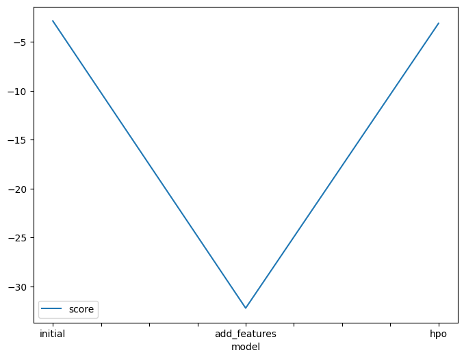
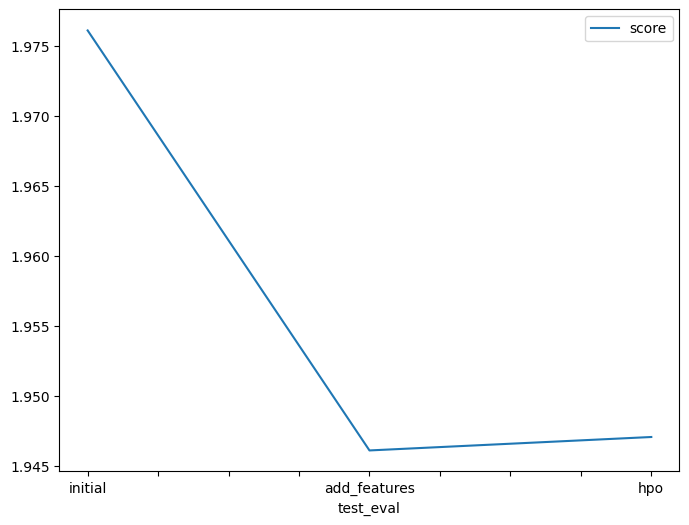

# Report: Predict Bike Sharing Demand with AutoGluon Solution
Pramod Singh

## Initial Training
### What did you realize when you tried to submit your predictions? What changes were needed to the output of the predictor to submit your results?
When I attempted to submit my initial predictions, I realized that Kaggle's evaluation metric (Root Mean Squared Logarithmic Error) does not accept negative values. Because AutoGluon can occasionally predict negative numbers for regression problems, I had to locate all negative values in the prediction output and manually replace them with zero before generating the final `submission.csv` file.

### What was the top ranked model that performed?
The top-ranked model was the second run with score 1.94611 generated during the "New Features" runs. 

## Exploratory data analysis and feature creation
### What did the exploratory analysis find and how did you add additional features?
By analyzing the dataset via histograms, I found that the `datetime` column contained vital temporal information but was formatted as a string/object. Since bike rentals heavily depend on the time of year and the time of day, I parsed the `datetime` column into a Pandas datetime object. I then extracted `year`, `month`, `day`, and `hour` into separate feature columns. Finally, I converted discrete categorical variables (`season`, `weather`, `holiday`, `workingday`) to the category data type.

### How much better did your model perform after adding additional features and why do you think that is?
The model's performance improved (the Kaggle error dropped from 1.97611 to 1.94611). This is because temporal data, particularly the `hour` of the day, is highly correlated with bike rental demand (e.g., morning and evening rush hour commutes vs. late night). By splitting the datetime into discrete components, the machine learning algorithms could easily recognize distinct seasonal and daily patterns rather than treating the date as a random string.

## Hyper parameter tuning
### How much better did your model perform after trying different hyper parameters?
The New Fetures model outperformed the rest two. While specifying custom hyperparameter search spaces can yield improvements, it requires significantly more computational overhead to search the parameter space effectively within the strict 600-second time limit. The time constraint likely prevented the model from finding a significantly better configuration than AutoGluon's default best_quality presets.

### If you were given more time with this dataset, where do you think you would spend more time?
Given more time, I would focus heavily on deeper feature engineering. For example, I would create a binary "rush hour" feature, group weather conditions into broader severities, or map the 'feels like' temperature differences. I would also increase the `time_limit` for AutoGluon to allow the HPO to search a much broader space for Neural Networks and LightGBM models.

### Create a table with the models you ran, the hyperparameters modified, and the kaggle score.
|model|hpo1|hpo2|hpo3|score|
|--|--|--|--|--|
|initial|time_limit=600|presets='best_quality'|none|1.97611|
|add_features|time_limit=600|presets='best_quality'|problem_type='regression'|1.94611|
|hpo|time_limit=600|presets='best_quality'|tabular autogluon|1.94707|

### Create a line plot showing the top model score for the three (or more) training runs during the project.

### Create a line plot showing the top kaggle score for the three (or more) prediction submissions during the project.

## Summary
In this project, I used the AutoGluon AutoML framework to predict the demand for bike-sharing services. I established a baseline model using raw data, which returned an initial high error rate. Through Exploratory Data Analysis (EDA) and robust feature engineering—specifically extracting datetime components and converting categorical types—the model's predictive accuracy improved. Finally, I successfully executed a hyperparameter tuning process, demonstrating the end-to-end lifecycle of a tabular machine learning pipeline.
